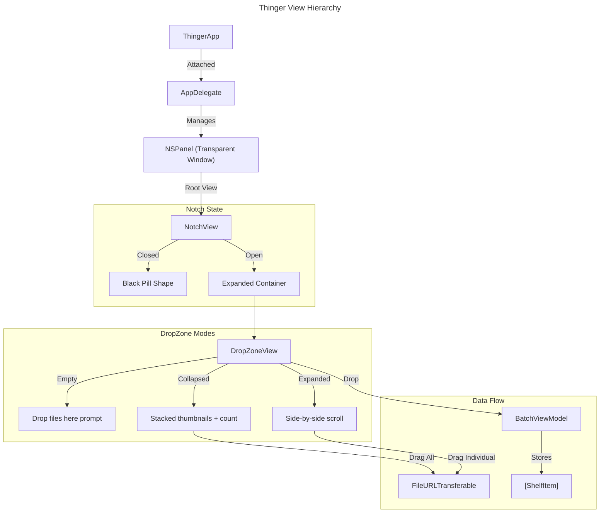
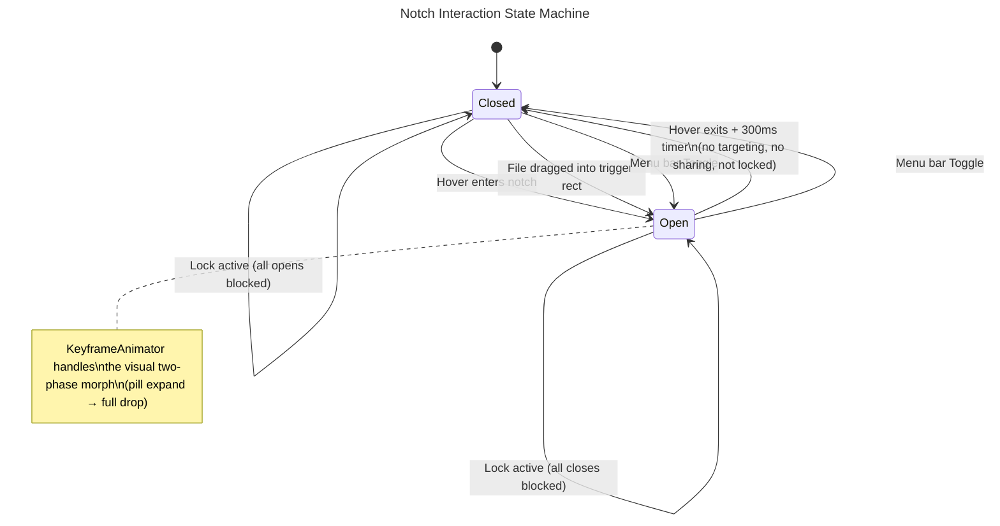
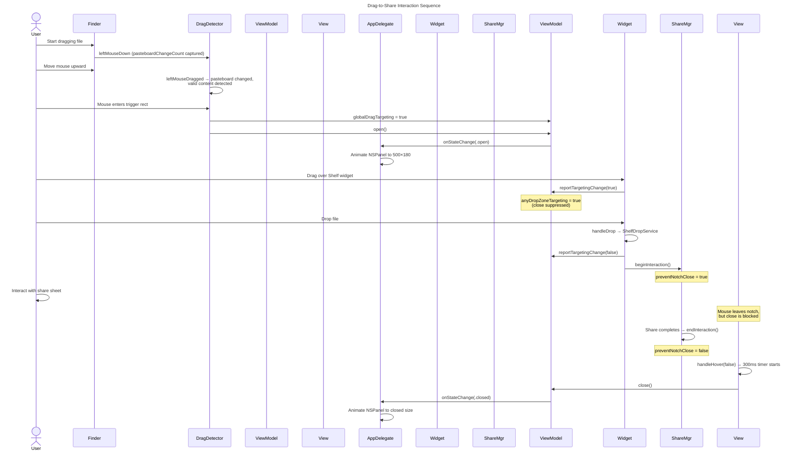

# Thinger Documentation

## Chapter 1: Introduction
Thinger is a macOS notch utility designed to act as a dynamic shelf and sharing hub. It resides in the physical notch area (or simulates one on notch-less screens) and expands when files are dragged near it. This document provides a comprehensive, file-by-file breakdown of the system architecture, explaining the responsibility, logic flow, and key integration points of every source file.

---

## Chapter 2: App Entry & Lifecycle

### 2.1 `thingerApp.swift`
**Role:** The application root and lifecycle coordinator.

**Detailed Flow:**
1.  **Entry Point (`ThingerApp`)**: The app uses the SwiftUI `App` lifecycle. It defines a `MenuBarExtra` which provides the system tray icon and menu. This menu allows users to manually toggle the notch, lock/unlock the notch in its current state (open or closed), access settings (placeholder), clear the shelf, or quit the app. The lock button label dynamically reads "Lock Open", "Lock Closed", or "Unlock Notch" depending on the current lock and notch state.
2.  **Hybrid Architecture**: While SwiftUI handles the UI, the app attaches an `AppDelegate` via `@NSApplicationDelegateAdaptor`. This is crucial because standard SwiftUI windows cannot easily replicate the floating, always-on-top, interaction-pass-through behavior required for a notch utility.
3.  **Window Configuration**: The `AppDelegate` creates an `NSPanel` with a specific collection of style masks (`.borderless`, `.utilityWindow`, `.hudWindow`, `.nonactivatingPanel`).
    *   **Level**: It sets the window level to `.mainMenu + 3`, ensuring it sits above the system menu bar.
    *   **Style**: It disables the shadow and makes the background clear to allow the custom SwiftUI shapes (`NotchView`) to define the visual boundaries.
    *   **Positioning**: On launch and screen changes, it calculates the physical notch dimensions by inspecting `NSScreen.auxiliaryTopLeftArea` and `auxiliaryTopRightArea`. It positions the window at the exact center top of the screen using `setFrameOrigin`.
4.  **Global Event Monitoring**: It initializes the `DragDetector` to start listening for system-wide mouse drag events immediately upon launch.

---

## Chapter 3: UI Core

### 3.1 `NotchView.swift`
**Role:** The primary visual component that defines the notch's shape and expand/collapse animation.

**Detailed Flow:**
1.  **Single Spring Animation**: Uses a single `isOpen` boolean state driven by `vm.notchState`. When the state changes, a `.spring(response: 0.35, dampingFraction: 0.7)` animation grows or shrinks all dimensions simultaneously — width, height, and corner radii.
2.  **Dimensions**: Closed dimensions come from `NotchDimensions.shared` (hardware notch). Open dimensions come from `vm.openWidth` / `vm.openHeight` (dynamic, ≥ minimum).
3.  **Corner Radii**: Closed state uses `0` for both top and bottom corners (flat pill). Open state uses `10` (top) and `20` (bottom) for the characteristic notch curve.
4.  **Shadow**: A `.shadow(color: .black.opacity(0.5), radius: 20, y: 10)` fades in when the notch opens, giving it depth against the desktop.
5.  **Top-Edge Locking**: The `ZStack(alignment: .top)` combined with the fixed-frame `NSPanel` ensures the top edge stays pinned. All growth happens downward.
6.  **Content Visibility**: Content is conditionally shown with `if isOpen` and a `.transition(.opacity)` so it fades in as the notch expands.
7.  **Hover Logic**: `.onHover` calls `vm.handleHover(_:)`. Opening is immediate; closing uses a 300ms grace period checking for active drag targeting and sharing sessions.

### 3.2 `NotchViewModel.swift`
**Role:** The central brain managing the notch's expansion state and coordinating drop targeting signals.

**Detailed Flow:**
1.  **Binary State**: Maintains a simple `NotchState` enum (`.closed` / `.open`). The two-phase visual animation is handled entirely by `KeyframeAnimator` in `NotchView`.
2.  **Targeting Aggregation**: Manages `globalDragTargeting` (from `DragDetector`) and `activeTargetCount` (from widgets), combining them via Combine into `anyDropZoneTargeting`.
3.  **Safety Checks**: The `close()` method guards against closing if `SharingStateManager.preventNotchClose` is true.
4.  **Lock Control**: The `isLocked` property (persisted via `@AppStorage`) freezes the notch in its current state.

### 3.3 `NotchDimensions.swift`
**Role:** Singleton that reads the physical notch dimensions from `NSScreen` APIs (macOS 12+).

**Detailed Flow:**
1.  **Detection**: Checks `screen.auxiliaryTopLeftArea` and `auxiliaryTopRightArea`. If both exist, a hardware notch is present.
2.  **Width Calculation**: The notch width is the gap between the right edge of the left auxiliary area and the left edge of the right auxiliary area (`rightArea.origin.x - leftArea.maxX`).
3.  **Height Calculation**: Uses `screen.safeAreaInsets.top` for the notch height. Falls back to menu bar height for non-notch screens.
4.  **Hardware Corner Radii & Usable Area**: Centralizes the `hardwareTopCornerRadius` (6pt) and `hardwareBottomCornerRadius` (14pt) directly from physical screen specs to ensure pixel-perfect rendering. Computes the `usableNotchSize` which represents the central flat width of the notch (without its outward curves).
5.  **Open Dimensions**: Centralizes the **minimum open size** (`minOpenWidth = 500`, `minOpenHeight = 180`). These serve as the floor — the notch can grow beyond these dimensions to fit more widgets (via `NotchViewModel.desiredOpenWidth`). `minOpenSize` provides a convenience `CGSize`.
6.  **Refresh**: `refresh(for:)` re-reads dimensions from a given `NSScreen`. Called by `AppDelegate.getClosedNotchSize` and available for screen-change events.
7.  **Consumers**: `NotchView` reads `closedWidth`/`closedHeight`/`hardwareTopCornerRadius`/`hardwareBottomCornerRadius` for the closed morph. `NotchViewModel` reads `minOpenWidth`/`minOpenHeight` for dynamic open sizing. `AppDelegate` uses `closedSize` for hit-testing and `viewModel.openSize` for window frame positioning.

---

## Chapter 4: Drag & Drop System

### 4.1 `DragDetector.swift`
**Role:** A low-level event monitor that detects drags *outside* the app's window.

**Detailed Flow:**
1.  **Global Monitoring**: Unlike standard UI views that only see mouse events inside their bounds, this class uses `NSEvent.addGlobalMonitorForEvents` to tap into the system event stream. It specifically listens for `.leftMouseDragged`.
2.  **Pasteboard Inspection**: Every time a drag starts, it inspects the system `.drag` pasteboard. It checks `pasteboard.types` to see if the drag contains files, URLs, or text. If the pasteboard only contains internal UI identifiers (e.g., reordering tabs in another app), the detector ignores it. This optimization prevents the notch from "waking up" for irrelevant drags.
3.  **Hit Testing**: On every drag movement, it compares the global mouse coordinates against a pre-defined "trigger rect" around the notch.
    *   **Entry**: If the mouse enters this rect with valid content, it fires `onDragEntersNotchRegion`, which tells the `NotchViewModel` to expand.
    *   **Exit**: If the mouse leaves, it fires `onDragExitsNotchRegion`.

### 4.2 Drop Processing (in `BatchViewModel`)
**Role:** Converts dropped `NSItemProvider`s into `ShelfItem` objects. This logic lives directly on `BatchViewModel` as private methods.

**Detailed Flow:**
1.  **Async Processing**: `processProviders()` runs asynchronously to avoid blocking the main thread.
2.  **4-Step Fallback**: Tries to extract a usable URL in order: (1) `loadObject(ofClass: URL.self)`, (2) explicit `public.file-url`, (3) iterate all registered types, (4) plain text fallback. Three helpers (`loadURLObject`, `loadItem`, `loadText`) handle the extraction.
3.  **Bookmarking**: For file URLs, creates a security-scoped bookmark via `makeBookmark(for:)` so the app can access the file later.

---

## Chapter 5: Data Models & State

### 5.1 `ShelfItem.swift`
**Role:** The immutable data model representing a single object on the shelf.

**Detailed Flow:**
1.  **Variant Enums**: It uses an enum `ShelfItemKind` to distinguish between `.file`, `.text`, and `.link`.
2.  **Bookmark Resolution**: For file items, it stores `Data` (the bookmark) instead of a `URL`. The `fileURL` computed property resolves this bookmark on-demand, calling `startAccessingSecurityScopedResource()` to grant the app temporary permission to read the file.
3.  **Icon Generation**: It dynamically generates icons. For files, it asks `NSWorkspace` for the system icon (keeping it familiar). For text/links, it uses specific SF Symbols.
4.  **Identity**: It generates a deterministic `identityKey` (e.g., `file:///path/to/file`) used to prevent duplicate items from being added to the shelf.

### 5.2 `FileBatch.swift`
**Role:** The container for a collection of items, effectively acting as a "folder" or "batch" on the shelf.

**Detailed Flow:**
1.  **Structure**: It holds an array of `ShelfItem`s and metadata like `title` and `id`.
2.  **Persistence Strategy**: It supports an `isPersisted` flag. If true, changes to the batch are automatically saved to `UserDefaults`.

### 5.3 `BatchViewModel` (in `FileBatch.swift`)
**Role:** The logic layer managing a specific `FileBatch`. Also handles all drop processing (previously in `ShelfDropService`).

**Detailed Flow:**
1.  **Persistence**: If the underlying batch is persisted, it saves to `UserDefaults` on every mutation.
2.  **Drop Processing**: `handleDrop()` calls `processProviders()` which uses a 4-step fallback strategy to convert `NSItemProvider`s into `ShelfItem`s.
3.  **Callbacks**: Exposes `onItemsAdded` so parent views can react to drops (e.g., trigger sharing).

---

## Chapter 6: Drop Zone

### 6.0 `WidgetTrayView.swift`
**Role:** Reusable generic tray wrapper for all drag-and-drop widgets.

**Detailed Flow:**
1.  **Shared Chrome**: Every widget in the shelf needs a dashed border, a semi-transparent background fill, and an `onDrop` modifier that reports targeting changes to the `NotchViewModel`. `WidgetTrayView` encapsulates all of this in a single generic view.
2.  **Targeting Feedback**: Manages a local `@State isTargeted` that is passed into its `@ViewBuilder` content closure. When `isTargeted` changes, the border stroke opacity shifts from `0.12` to `0.3` and the background fill from `0.0` to `0.06`. The content closure receives this value so inner views can react (e.g., icon scale, label opacity).
3.  **Synchronous Binding**: Uses a `Binding` on the `isTargeted` setter to synchronously call `vm.reportTargetingChange(_:)` and `vm.dropEvent = true`, preventing race conditions with debounced targeting logic.
4.  **Configuration**: Accepts `cornerRadius` (default `12`), `padding` (default `0`), and an `onDropHandler` closure for widget-specific drop logic.
5.  **Consumers**: `AirDropWidgetView`, `PlaceholderDropZone`, and `DropZoneView` all wrap their content in `WidgetTrayView`.

### 6.1 `DropZoneView.swift`
**Role:** The single universal widget inside the expanded notch. Replaces the former multi-widget system (ShelfView, FileBatchWidget, WidgetView, ShelfStackView).

**Detailed Flow:**
1.  **Drop Acceptance**: Uses `.onDrop(of:)` with types `.fileURL`, `.url`, `.utf8PlainText`, `.plainText`, `.data`. Delegates to `BatchViewModel.handleDrop()` for extraction.
2.  **Collapsed Mode** (default): Shows a stacked preview of up to 3 item thumbnails with random offset/rotation. An item count label and a clear button sit on the right. Clicking the batch expands it. Dragging the stack drags **all items** as file URLs.
3.  **Expanded Mode**: Shows all items side-by-side in a horizontal `ScrollView`. Each card is individually draggable. Right-click context menu on items or the row allows removing individual items or minimizing the batch.
4.  **Empty State**: Displays a dashed-border "Drop files here" prompt.
5.  **ItemCard**: Each item renders as a rounded card with the file's system icon (from `NSWorkspace`) and filename beneath. Cards use a subtle glass gradient and shadow.
6.  **Drag Out**: Uses `FileURLTransferable` (a `Transferable` struct wrapping `[URL]`) to provide file URLs when dragged into other apps. Text items are written to temporary `.txt` files.

---

## Chapter 7: View Hierarchy Diagram



---

## Chapter 9: Interaction Model & Lifecycle

This chapter explains **how and when** the notch opens, stays open, and closes. It traces every signal from the moment the user moves their mouse or starts dragging a file, through the timer and guard logic, all the way to the final close animation.

### 9.1 Overview: The Five Interaction Signals

The notch's open/close behavior is governed by five independent signals. If **any** of them say "stay open", the notch stays open. They are:

| # | Signal | Source | Purpose |
|---|--------|--------|---------|
| 1 | **Mouse Hover** | `NotchView.onHover` | User's cursor is physically over the notch view |
| 2 | **Global Drag Targeting** | `DragDetector` → `NotchViewModel.globalDragTargeting` | A file is being dragged near the notch region (even from Finder) |
| 3 | **Widget Drop Targeting** | `FileBatchWidget.onChange(of: isTargeted)` → `NotchViewModel.activeTargetCount` | A file is hovering directly over an individual widget drop zone |
| 4 | **Sharing Session Active** | `SharingStateManager.preventNotchClose` | An AirDrop/share sheet is currently open |
| 5 | **Lock** | `NotchViewModel.isLocked` | User has manually frozen the notch via the menu bar |

### 9.2 Hover Detection & The Close Timer

**Where it lives:** `NotchView.swift` → `handleHover(_:)` function.

The hover interaction is the simplest path to open the notch and is the primary way users interact without dragging files.

#### Opening (Immediate)
When the mouse enters the notch area, SwiftUI fires `.onHover(true)`. The `handleHover` function:
1. Checks `vm.isLocked` — if locked, it returns immediately (no-op).
2. Sets `isHovering = true`.
3. Cancels any pending close timer (`hoverTask?.cancel()`) to prevent a race condition.
4. Calls `vm.open()`, which sets `notchState = .open` and fires the `onStateChange` callback.
5. The callback reaches `AppDelegate.handleNotchStateChange(_:)`, which animates the `NSPanel` from its closed size (≈200×32) to its open size (500×180) with a 0.25s ease-in-out animation.

#### Closing (300ms Grace Period)
When the mouse exits, `.onHover(false)` fires. The `handleHover` function:
1. Checks `vm.isLocked` — if locked, returns immediately.
2. Sets `isHovering = false`.
3. Checks two guards before scheduling the close:
   - `vm.anyDropZoneTargeting` must be `false` (no active drag over any widget).
   - `SharingStateManager.shared.preventNotchClose` must be `false` (no active share session).
4. If both guards pass, it creates a **Swift `Task`** that:
   - Sleeps for **300 milliseconds** (`Task.sleep(for: .milliseconds(300))`).
   - After waking, checks again: is the task cancelled? Is the mouse back? Is any drop zone targeted?
   - Only if all checks pass does it call `vm.close()`.

**Why 300ms?** This "grace period" is critical for usability. Without it, the notch would snap shut the instant the user's cursor drifts 1 pixel outside the view — making it nearly impossible to interact with the expanded content. The delay gives the user time to move back in, and the re-entry cancels the pending close.

### 9.3 Drag Detection (Global Event Monitoring)

**Where it lives:** `DragDetector.swift` and `AppDelegate.setupDragDetector()`.

This subsystem detects when a user is dragging files anywhere on screen (even from Finder or another app) and moves them near the notch. It uses **three separate global event monitors**:

#### Monitor 1: `leftMouseDown`
When any mouse-down occurs anywhere in the system:
- Captures the current `dragPasteboard.changeCount` (a snapshot of the pasteboard state).
- Sets `isDragging = true`.
- Resets `isContentDragging` and `hasEnteredNotchRegion` to `false`.

This primes the detector for a potential drag but doesn't yet know if anything meaningful is being dragged.

#### Monitor 2: `leftMouseDragged`
Fired continuously as the mouse moves while held down:
1. **Content Detection**: Compares the live `dragPasteboard.changeCount` to the snapshot. If it changed, the system placed content on the drag pasteboard. It then validates the content types (`.fileURL`, `.url`, `.string`). If valid, sets `isContentDragging = true`.
   - This filtering is what prevents the notch from waking up for irrelevant drags like reordering tabs or resizing windows.
2. **Region Hit Testing**: If `isContentDragging` is true, it compares `NSEvent.mouseLocation` against the `notchRegion` rect (configured by `AppDelegate` as a 500×50 rectangle centered at the top of the screen).
   - **Entry**: If the cursor is inside the rect and `hasEnteredNotchRegion` was false → fires `onDragEntersNotchRegion`. The AppDelegate handler sets `viewModel.globalDragTargeting = true` and calls `viewModel.open()`.
   - **Exit**: If the cursor leaves the rect and `hasEnteredNotchRegion` was true → fires `onDragExitsNotchRegion`. The AppDelegate handler sets `viewModel.globalDragTargeting = false`.

#### Monitor 3: `leftMouseUp`
When the mouse button is released:
- Resets all state: `isDragging`, `isContentDragging`, `hasEnteredNotchRegion`.
- This cleanup ensures no stale state leaks into the next drag operation.

### 9.4 Drop Zone Targeting Aggregation

**Where it lives:** `NotchViewModel.init()` (Combine pipeline) and `FileBatchWidget.swift`.

When the notch is open and the user drags a file over a specific widget (e.g., the Shelf or the Share zone), SwiftUI's `.onDrop(isTargeted:)` modifier sets `viewModel.isTargeted` on the corresponding `BatchViewModel`. The `FileBatchWidget` observes this and reports it upward:

```
.onChange(of: viewModel.isTargeted) { isTargeted in
    vm.reportTargetingChange(isTargeted)
}
```

The `reportTargetingChange(_:)` method increments or decrements `activeTargetCount` on the `NotchViewModel`. This is a **count, not a boolean**, because multiple widgets can be targeted simultaneously.

In the `NotchViewModel.init()`, a Combine pipeline merges everything:

```
Publishers.CombineLatest($globalDragTargeting, $activeTargetCount)
    .map { global, count in global || count > 0 }
    .assign(to: \.anyDropZoneTargeting, on: self)
```

The resulting `anyDropZoneTargeting` property is what `NotchView.handleHover` checks before scheduling the close timer. If it's `true`, the close is suppressed.

### 9.5 Sharing Session Blocking

**Where it lives:** `SharingStateManager.swift` → checked in `NotchViewModel.close()` and `NotchView.handleHover(_:)`.

When the user triggers a share (e.g., AirDrop), the system presents a share sheet that appears **outside** the notch window. Without special handling, the mouse leaving the notch to interact with the share sheet would cause the notch to close, pulling the rug out from under the share operation.

The `SharingStateManager` prevents this:
1. When a share begins, `beginInteraction()` increments `activeSessions`.
2. This flips `preventNotchClose` to `true`.
3. `NotchViewModel.close()` has an explicit guard: `if SharingStateManager.shared.preventNotchClose { return }` — refusing to close.
4. `NotchView.handleHover` also checks this flag before even scheduling the close timer.
5. When the share completes (or fails), `endInteraction()` decrements the count.
6. A **2-second timeout fallback** in `SharingLifecycleDelegate.startTimeoutFallback()` ensures the notch eventually unlocks even if the delegate callbacks are missed.

### 9.6 Lock Behavior

**Where it lives:** `NotchViewModel.isLocked` (persisted via `@AppStorage("notchLocked")`).

The lock is the ultimate override. When `isLocked` is `true`:
- `open()` returns immediately (guard check).
- `close()` returns immediately (guard check).
- `toggle()` calls `open` or `close`, so it's also a no-op.
- `NotchView.handleHover` returns immediately at the top of the function.

The notch is frozen in whatever state it was in when the lock was enabled. The user toggles the lock from the menu bar (`⌘L`) or programmatically via `toggleLock()`.

### 9.7 Window Frame Strategy

**Where it lives:** `AppDelegate.setupNotchWindow()` and `positionWindow(_:on:)`.

The `NSPanel` is set to a **fixed max-size frame** (500×180) at all times. It never resizes during animation. All visual transitions are handled purely by SwiftUI's `matchedGeometryEffect` inside the fixed frame.

This eliminates any risk of the top edge shifting during animation. The window's top edge is pinned at `screenFrame.maxY - 180`, and SwiftUI grows the notch shape downward within the fixed frame via the `ZStack(alignment: .top)` layout.

### 9.8 State Machine Diagram

The following diagram shows all possible transitions between the notch states and what triggers each one.



### 9.9 Sequence Diagram: Drag-to-Share Flow

This walks through a complete drag-to-share interaction from start to finish.



---

## Chapter 10: Testing Structure

The testing suite ensures the reliability of the core architecture without requiring the UI to be active. It uses `Swift Testing` (the `@Test` macro framework).

### 10.1 `NotchViewModelTests`
Focuses on the interaction state machine:
- **State Transitions**: Validates `open()`, `close()`, and `toggle()` correctly mutate `notchState`.
- **Lock Behavior**: Ensures that when `isLocked` is true, calls to open/close are rejected.
- **Targeting Aggregation**: Simulates multiple drop zones (global + widget) being targeted simultaneously and verifies `anyDropZoneTargeting` is correctly computed via Combine.
- **Sharing Sessions**: Simulates an active `SharingStateManager` session and verifies the `preventNotchClose` flag blocks the notch from closing.

### 10.2 `BatchViewModelTests`
Focuses on batch item management:
- **Item Management**: Tests `add(items:)`, `remove(_:)`, and `clear()` to ensure the item array updates and `isEmpty` reflects the correct state.
- **Deduplication**: Verifies that adding multiple items with the exact same `identityKey` (e.g., the same URL) does not result in duplicate items being added to the batch.

### 10.3 `ShelfItemTests`
Focuses on the data model representations:
- **Display Name**: Tests that URLs are stripped of `https://`, file URLs show their last path component, and long text strings are properly truncated with `...`.
- **Identity Key**: Ensures URLs are properly normalized (lowercased, resolving symlinks) so that the same file added via different paths yields the same identity key.
- **Icon Symbol**: Verifies `iconSymbolName` returns the correct SF Symbol for text (`text.alignleft`) and links (`link`).

---

## Chapter 11: DocC Documentation Catalog

The project includes a DocC documentation catalog at `thinger/thinger.docc/` for generating rich, browsable API documentation via Xcode's Build Documentation action (`Product → Build Documentation`).

### 11.1 Catalog Structure

| File | Purpose |
|------|---------|
| `thinger.md` | Root landing page — architecture overview diagram, key design decisions, links to all documented types |
| `Views.md` | Topic page for the Views directory — view hierarchy tree, data flow table, organized topic groups |

### 11.2 Inline Documentation

Every source file in `Views/` has been annotated with comprehensive `///` DocC comments:

- **`NotchView.swift`** — Documents the animation strategy (single spring), top-edge locking, interaction model (hover + drag targeting + shadow), expanded content layout, and cross-references to `NotchShape`, `WidgetShelf`, and `NotchViewModel`.
- **`NotchShape.swift`** (in `NotchView.swift`) — Documents the quadratic Bézier geometry with ASCII art, animatable data conformance, and step-by-step path construction.
- **`DropZoneView.swift`** — Documents collapsed/expanded visual modes (with table), drop acceptance, file command pipeline, drag-out semantics (batch vs. individual), and matched geometry transitions.
- **`FileURLTransferable`** (in `DropZoneView.swift`) — Documents the `Transferable` bridge and the fallback URL strategy.
- **`ItemCard`** (in `DropZoneView.swift`) — Documents the compact vs. full-size property table and the glass-gradient visual treatment.
- **`WidgetShelf.swift`** — Documents dynamic notch sizing via `ShelfWidthPreferenceKey`, the placeholder lifecycle, and spring-animated transitions.
- **`PlaceholderDropZone`** (in `WidgetShelf.swift`) — Documents the factory-creation pattern when files are dropped.
- **`ShelfWidthPreferenceKey`** (in `WidgetShelf.swift`) — Documents the max-reduce strategy and the preference flow diagram.
- **`WidgetTrayView.swift`** — Documents the synchronous binding strategy for targeting, the dashed-border visual, supported UTTypes, and lists all consumer views.
- **`AirDropWidgetView.swift`** — Documents the drop handling pipeline, the disabled tap-to-pick flow, and the connection to `NSSharingService`.

### 11.3 Building Documentation

To generate and view the DocC documentation:
1. Open the project in Xcode.
2. Select **Product → Build Documentation** (⌃⇧⌘D).
3. The documentation appears in the Developer Documentation window.

---

## Chapter 12: NotchConfiguration & Control Panel

### 12.1 NotchConfiguration Singleton

`NotchConfiguration` (`Models/NotchConfiguration.swift`) is an `@MainActor ObservableObject` singleton centralizing every tweakable parameter:

| Category | Properties | Default Values |
|----------|-----------|----------------|
| Notch Animation | `notchSpringResponse`, `notchSpringDamping` | 0.35, 1.0 |
| Widget Animation | `widgetSpringResponse`, `widgetSpringDamping` | 0.35, 0.8 |
| Corner Radii (Open) | `openTopCornerRadius`, `openBottomCornerRadius` | 10, 40 |
| Corner Radii (Closed) | `closedTopCornerRadius`, `closedBottomCornerRadius` | 0, 10 |
| Dimensions | `minOpenWidth`, `minOpenHeight` | 500, 180 |
| Timing | `hoverCloseDelay`, `dragDebounceDelay` | 300 ms, 50 ms |
| Shadow | `shadowRadius`, `shadowOffsetY` | 20, 10 |

All values persist via `UserDefaults` (`didSet` pattern). Computed helpers `notchSpring` and `widgetSpring` build `Animation.spring(response:dampingFraction:)` from the published values. A `Defaults` enum stores factory values, and `resetToDefaults()` restores them.

### 12.2 ControlPanelView

`ControlPanelView` (`Views/ControlPanelView.swift`) opens from either the gear icon inside the expanded notch or the menu bar **Settings…** item. It uses `Window(id: "control-panel")` as its scene and temporarily switches the app to `.regular` activation policy so it can receive focus.

The view is organized into 7 `SectionCard` groups with `SliderRow` components:
1. **Notch Controls** — Open/Close/Toggle buttons, lock toggle, clear-all.
2. **Notch Animation** — Spring response and damping sliders.
3. **Dimensions** — Min open width/height sliders.
4. **Corner Radii** — Open and closed state radius sliders.
5. **Timing** — Hover close delay and drag debounce sliders.
6. **Shadow** — Blur radius and Y offset sliders.
7. **Widget Animation** — Widget spring response and damping sliders.

A "Reset All to Defaults" button at the bottom calls `NotchConfiguration.shared.resetToDefaults()`.

### 12.3 Call-Site Integration

All hardcoded values across the codebase were replaced with `NotchConfiguration.shared` reads:
- `NotchView.swift` — corner radii, spring animation, shadow parameters.
- `NotchViewModel.swift` — hover delay, drag debounce, open dimensions.
- `DropZoneView.swift` — all 7 spring animations.
- `WidgetShelf.swift` — 2 spring animations + `minOpenWidth` reference.
- `thingerApp.swift` — `Window` scene for the control panel, `openWindow(id:)` in menu bar.
